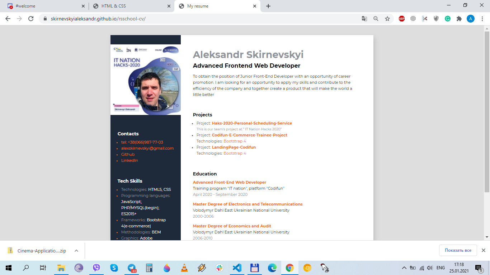

# rsschool-cv-html
[stage0/#/tasks/html-css](https://rolling-scopes-school.github.io/stage0/#/tasks/html-css)  
  
[demo-cv]https://skirnevskyialeksandr.github.io/rsschool-cv/  
##  self-assessment - 100  
The layout is valid;

HTML5 semantic tags are present in the page code;

H1-h6 headings are used; 

css-styles are used;

Content is placed in a block that is horizontally centered on the page; 

There is an image on the CV page, the proportions of the image are not distorted, the image has an alt attribute; 

The contact details and the list of skills are arranged as a list ul > li;

CV contains contacts, brief information about yourself, the list of skills, examples of code or completed projects, information about education and English;

CV is in English ;

The repository requirements are fulfilled: there is a link to the job, a screenshot of the CV page, a link to the deplacement of the CV page on GitHub Pages, the self-assessment is done;

